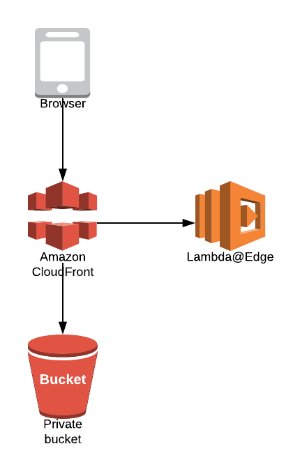
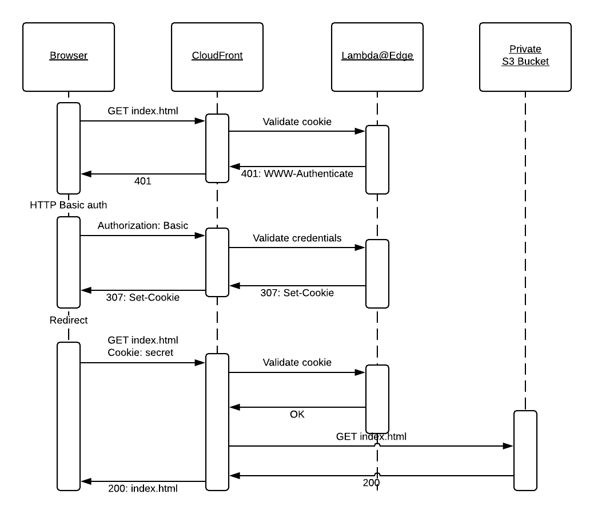

# aws-cloudfront-basic-auth
Basic authentication for CloudFront with Lambda@Edge without reserving Authorization header

### Motivation
This solution was built to password protect React Web Application development environments from public access

Requirements for the solution were
*  Restrict access to the development environments
*  Serverless solution
*  Authorization header reserved for JWT Bearer token (No simple Basic auth) 
*  No cumbersome WAF IP-restrictions
*  Can’t use a custom HTTP header (Difficult to set on mobile test devices)
*  Don’t want to infect or change the Web Application

## Disclaimer
This solution should NOT be used in production environments or for protecting any sensitive data. 

## Prerequisites
* You need to specify a domain name for the CloudFront
* You need to have an ACM certificate for the above domain
* Lambda@Edge functions MUST be deployed to the 'us-east-1' region

## Steps to deploy
* Generate an ACM certificate for the desired domain name
* Create a new stack from template [basic-auth-edge-lambda.yaml](cloudformation/basic-auth-edge-lambda.yaml)
* Create a new stack from template [web-frontend.yaml](cloudformation/web-frontend.yaml)
    * Input as a parameter the ARN of the ACM Certificate matching the desired domain
    * Input the desired domain name 
    * Input as a parameter ARN of the basic auth edge lambda function (exported from the first stack)
    * Input as a parameter Version of the basic auth edge lambda function (exported from the first stack)
* Upload index.html with any content to the root of the private S3 bucket 

## Good to know
* Lambda@Edge does not support Environment variables why stack parameters are injected with the !Sub function to the Lambda function code
* Even the browser sends the Basic auth information in Authorization header after login, it can be overwritten in JavaScript
* Logging out of HTTP Basic auth can only be done by responding 401 from server and setting false credentials
* Would be good idea to rotate cookie secret and password regularly

## Serverless Web Application Infrastucture

## Sequence diagram of the authentication logic

### Credit
Inspired by [lmakarov/lambda-basic-auth.js](https://gist.github.com/lmakarov/e5984ec16a76548ff2b278c06027f1a4)
